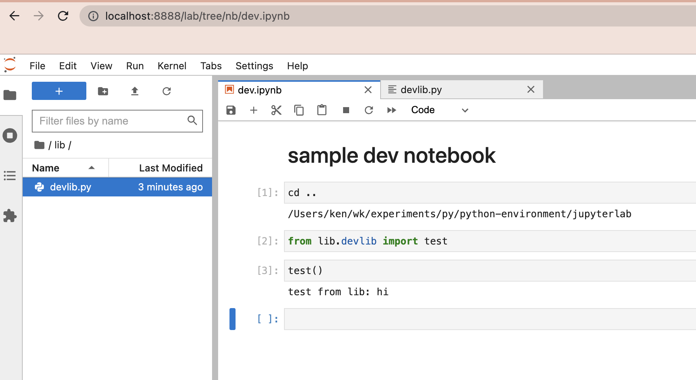

# jupyterlab example

basic jupyterlab example

- [jupyterlab example](#jupyterlab-example)
- [how to run](#how-to-run)
- [original setup](#original-setup)

# how to run

```
source env/bin/activate
env/bin/jupyter-lab
```
now you can develop in the browser:



# original setup

same setup as [parent](../README.md)

then...

```
python -m venv env
# activate virtual env
source env/bin/activate

# install packages
python -m pip install jupyterlab

# freeze into requirements
python -m pip freeze > requirements.txt

# then, later on you can load them like this
python -m pip install -r requirements.txt
```